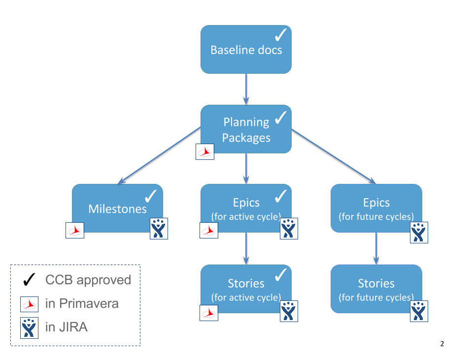

:tocdepth: 2

.. sectnum::

.. _change-record:

Change Record
=============

+-------------+------------+----------------------------------+-----------------+
| **Version** | **Date**   | **Description**                  | **Owner**       |
+=============+============+==================================+=================+
| 1.0         | 2016-08-11 | First version.                   | Jacek Becla     |
+-------------+------------+----------------------------------+-----------------+

.. _intro:

Introduction
============

This document describes the project planning processes and tools used in the
DM Subsystem, with particular emphasis on software development.

LSST is now in construction, funded through NSF MREFC. The planning process has
to conform to all government standards and requirements, including mandated
Earned Value Management System (EVMS).

The team responsible for delivering the LSST DM Software is approaching 100 engineers and
scientists, and is highly distributed geographically. It is essential all processes are robust
and clearly defined, and everyone understands how to apply them; what tools to use and how.

The DM Software is large and complex, and will be written over the entire period of
the construction (7 years). To ensure the team delivers production-quality software
that meets the baseline specification on time and within budget, having a solid, realistic,
resource-loaded, well maintained long-term plan is a must. Further,
appropriate tools and processes need to be in place to track the progress and
execute the long-term plan.

Using modern techniques, in particular the Agile Process, is extremely useful in particular
for short-term planning, managing short-term activities, and maximizing
the team's efficiency.

The project planning processes described in this documents have been structured to
address all of the above (often not fully aligned!) needs. It is a fusion of
the Earned Value Management System, and the Project Planning with Agile Process.

.. NOTE::
   Some of the processes described in this document are not yet implemented.
   The expected completion of implementing them is December 31, 2016.

.. _baseline-plan:

DM Project Management Planning Process
======================================

This section explains how the DM Subsystem approaches project planning and plan execution.

Baseline Documents
------------------

The baseline design and architecture of the DM Subsystem is captured through a set of change-controlled
documents, including:

* LDM-148 DM System Design

* LDM-151 DM Applications Design

* LDM-152 DM Middleware Design

* LDM-135 DM Database Design

* LDM-131 DM SUIT Conceptual Design

The complete set of DM baseline documents can be found in Docushare, Collection-2511.

All together, this collection of documents capture all work DM has to deliver during the LSST Construction.

Planning Packages
-----------------
The work is divided into a few hundred concrete, technical *packages of planned work*. The packages divide work
at the 4th Level of WBS, e.g., typically a 4th Level WBS is broken down into 20-50 packages. Each such package
addresses a piece of work defined in the baseline documents, and all together they cover the entire DM baseline.
Each package has a clearly defined scope, deliverable(s), resource cost, and an end date. Additionally,
each package keeps track of which section(s) of which baseline document it implements.

In the EVMS world, these packages are implemented directly as *Planning Packages* (PP).

Milestones
----------
All significant development stages of each planning package are tracked through *milestones*.
Each planning package has at least one milestone, used to mark the completion of a given package.
It is not uncommon to have multiple milestones per package to track progress along the way.
Milestones can be related to multiple planning packages, potentially from different WBSes.
Each milestone has a description, and due date; it has no duration, and no resources assigned to it.

Each activity within a planning package that involves a cross-team dependency is required to end with
a milestone; this includes activities related to delivering software components, hardware, and services.

Further, milestones have *levels*:

* Level 1 denotes the most important milestones exposed at the NSF level

* Level 2 denotes cross-subsystem milestones (for example, DM milestones that affect the Camera Subsystem)

* Level 3 denotes cross-team milestones within a subsystem (for example, Middleware milestones that affect the DRP Team)

* Level 4 denotes internal milestones within a team.

Relationships between milestones, as well as between milestones and planning packages are captured:
milestones typically *block* planning packages and other milestones.

Baseline Long-Term Plan
-----------------------

Planning packages, together with milestones form the *Baseline Plan*.
This plan is under change control.
As such, most changes to the plan, including changing scope, cost or schedule, must be approved by the appropriate body.
Specifically:

* Change Control Board approval is required for any non-trivial change to a planning package or Level 1 or 2 milestone;

* DM :abbr:`TCT (Technical Control Team)` approval is required for changes to level 3 milestones;

* No approval is required for Level 4 milestones, however any non-trivial change must be communicated to the DM team;

* Trivial changes, such as small corrections / clarifications to narrative that do not affect scope, time or budget are allowed without approval.

Typically, adjustments to Level 1, 2 and 3 milestones are made every 6 or 12 months. Changes to Level 4
milestones can occur more frequently.

Short-Term Planning
-------------------

The short-term plan is managed through *epics* and *stories*, and executed through *cycles*.

In the EVMS world, epics map directly to *activities*, and stories map to *activity steps*.

Epics and Stories
~~~~~~~~~~~~~~~~~

Typically, planning packages encompass relatively large blocks of work.  In practice, to execute and track
work, a finer grain of planning is required. This is implemented through epics and stories.

Each epic captures a non-trivial subset of the work defined in a planning package.  The epic has a clear
description, well defined deliverables, and relationships with planning packages (an epic *implements* a subset of a PP),
and milestones (an epic *blocks* a milestone). Epics covering non-estimable research work are timeboxed.
Every epics is resource loaded and has start and end dates defined.

Each epic is broken into smaller chunks of work, called *stories*. Stories are primarily used
to define and manage the short-term activities of individual developers.

Epics and stories are used to track all software work, as well as work on delivering hardware and services
that are tightly coupled with software (example: "Deliver OpenStack-based Test Cluster running RedHat 6.1".)
Work which has no direct relationship to software development do not have to be flowed down to stories
(example: "Deliver 10Gbit link between Chile and USA").

.. _cycles-and-releases:

Cycles and Releases
~~~~~~~~~~~~~~~~~~~

The work is executed through 6-month *cycles*. The scope of work for each cycle is driven by the
Baseline Plan, in particular by milestones. Each cycle ends with a new software release. Releases are
tested and documented according to standards defined in separate DM documents (the reference will be
added once these documents are finished).

Cycles are planned through *epics*. Each epic must be defined such that it can be completed
within a single cycle.

Once a plan is defined for a given cycle, it is loaded to Primavera and change-controlled. A plan for
a cycle is loaded to Primavera during the month proceeding the start of the cycle.

After a cycle has started, any adjustments to the plan for that cycle which affect scope, schedule or budget
must be approved by the LSST :abbr:`CCB (Change Control Board)`.

Level of Effort
---------------

Two general rules are applied for the DM Team labor when determining whether an activity should be
treated as LOE or non-LOE:

* All activities that have a clear deliverable are tracked through non-LOE. Examples of non-LOE
  activities include developing a new piece of software, purchasing new equipment, adding new
  machines to the cluster, or writing a technical note.

* Activities that cannot be predicted, as well as short, recurring routine activities are considered LOE.
  Examples of LOE activities include replacing a faulty disk drive, cluster maintenance, or writing monthly
  status reports.

For planning purposes, on average 70% of available time of each software developer is assumed to be
available for "pure, uninterrupted coding", and the remaining 30% is considered as "overhead", and tracked
explicitly as LOE.

A small portion of certain hardware and service contracts is for labor. This labor overhead is managed
as LOE, directly in dollars, rather than as epics and stories.

People
======

The DM Project Manager is responsible for the overall DM plan, schedule and priorities, as well as
mediating any disagreements that might arise. The work is
divided into smaller pieces through WBS, and assigned to technical and cost account managers (TCAMs),
such that each piece has one dedicated TCAM. Main responsibilities of TCAMs:

  * Assemble the team capable of delivering work scoped through the WBS on-time and within budget.
    Provide daily technical management and leadership for the team, monitor and optimize team performance.

  * Work closely with the DM Project Manager on defining short and long-term plan and schedule for
    their teams. Direct the execution of their team's plan, ensuring the team delivers on-time and within budget.

  * Report group's activities as required, including reporting to the Earned Value Management System (EVMS)
    used by LSST, and providing input for monthly status reports.

Note that the DM Organization is described in a separate document (LDM-294).

Tools
=====

The master copy of the Baseline Plan, which includes all planning packages and all milestones is captured
in Primavera. This is always the authoritative source of truth for the Baseline Plan.

Information about milestones is also kept in JIRA DM Baseline Plan (DMBP) project, and is periodically
synchronized with Primavera. Having milestones in JIRA is, in particular, useful for expressing blocking
relationships between milestones and epics between different teams.

The master set of epics and stories is kept in JIRA "DM" project. Epics corresponding to the current
and upcoming cycles are snapshotted and loaded to Primavera.

Information in JIRA for the current cycle is particularly important: it needs to be
kept up-to-date and it should reflect the current state of development. Progress
updates for activities that block other teams, in particular when the delivery date
approaches, are expected to be provided promptly (depending on urgency, weekly or even daily)

The JIRA DMBP serves as an easy-to-use interface that TCAMs can use to interact with
the Baseline Plan. Changes made to the JIRA DMBP are periodically submitted to CCB
and transferred to the Primavera when approved (every 6 or 12 months). The Primavera
version is always the authoritative source of truth.

The above diagram summarizes what needs to be approved by CCB, what is stored in
Primavera, and what is stored in JIRA.
